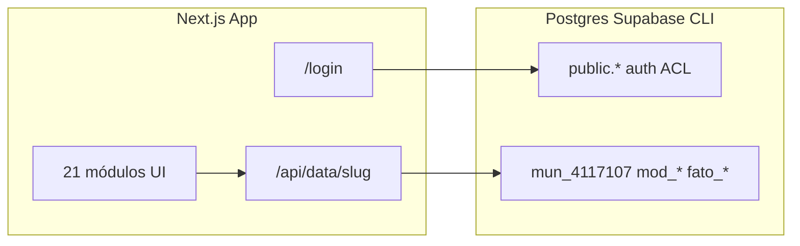
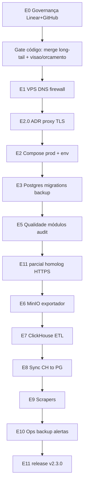

# Análise do código e revisão do plano consolidado VPS/Pipeline

> Status: **executado em 2026-06-09** — todos os 7 todos abaixo concluídos. Projeto Linear "[Mirante Painel — VPS Pipeline v2.x](https://linear.app/code42dev/project/mirante-painel-vps-pipeline-v2x-937f65e421e8)" com issues [MIR-2..MIR-14](https://linear.app/code42dev/team/MIR) criadas; 15 milestones espelho no GitHub (`mirantegov/painel#9..#23`).
>
> Decisões tomadas durante a execução:
> - Domínio principal: `painel.mirantegov.cloud`.
> - Proxy TLS: **Traefik no Docker Compose** (ADR em [`docs/adr-proxy-tls.md`](adr-proxy-tls.md)).
> - Convenção MinIO canônica: `s3://mirante-parquet/<ibge>/<tabela>/[ano=<ano>/]part-0.parquet`.
> - Releases: `v2.1.0` (homolog) → `v2.2.0` (pipeline) → `v2.3.0` (operacional).

## Resumo dos artefatos gerados

| Todo | Status | Artefatos |
| --- | --- | --- |
| `update-plano-doc` | ✅ | [`docs/plano-consolidado-vps-pipeline.md`](plano-consolidado-vps-pipeline.md) atualizado |
| `adr-proxy` | ✅ | [`docs/adr-proxy-tls.md`](adr-proxy-tls.md) (decisão: Traefik) |
| `minio-path-contract` | ✅ | [`infra/clickhouse/schema/etl/README-pipeline.sql`](../infra/clickhouse/schema/etl/README-pipeline.sql) + [`docs/clickhouse-epico5-design.md`](clickhouse-epico5-design.md) alinhados |
| `homolog-smoke` | ✅ | [`app/api/health/route.ts`](../app/api/health/route.ts) (liveness + `?db=1`) |
| `compose-prod-postgres` | ✅ | [`docker-compose.prod.yml`](../docker-compose.prod.yml) + [`.env.production.example`](../.env.production.example) |
| `linear-github-sync` | ✅ | Linear MIR-2..MIR-14, GitHub milestones #9..#23, tabela publicada no plano consolidado |
| `gate-long-tail` | ✅ | [`lib/demo-visao-geral.ts`](../lib/demo-visao-geral.ts), [`components/visao-geral.tsx`](../components/visao-geral.tsx) e [`components/orcamento-municipal.tsx`](../components/orcamento-municipal.tsx) migrados para `useSnapshot`; seed atualizado; typecheck + lint + build OK |

---

## 1. Situação atual do código (2026-06-09)

### O que já está entregue e funcional em dev



| Área | Estado | Evidência |
|------|--------|-----------|
| App Next.js 16 + React 19 | Entregue | [`package.json`](../package.json), [`Dockerfile`](../Dockerfile) (node slim, standalone) |
| Auth JWT + cookie `mp_session` | Entregue | [`lib/auth/jwt.ts`](../lib/auth/jwt.ts), [`app/api/auth/login/route.ts`](../app/api/auth/login/route.ts), [`middleware.ts`](../middleware.ts) |
| Multi-tenant Postgres | Entregue | 7 migrations em [`supabase/migrations/`](../supabase/migrations/), `provision_municipio()` |
| Leitura de módulos | Entregue | [`lib/data/modules.ts`](../lib/data/modules.ts), [`app/api/data/[modulo]/route.ts`](../app/api/data/[modulo]/route.ts), [`components/use-snapshot.ts`](../components/use-snapshot.ts) |
| Seed demo Nova Londrina | Entregue | [`scripts/seed-demo.ts`](../scripts/seed-demo.ts) — 21 módulos ACL, fatos, snapshots long-tail |
| ClickHouse SIM-AM | Schema entregue | [`infra/clickhouse/`](../infra/clickhouse/) — 224+224 tabelas, seeds, tools |
| MinIO | Compose separado | [`infra/docker-compose.minio.yml`](../infra/docker-compose.minio.yml) |
| Exportador Go | Avançado | [`exporter/`](../exporter/) + manifest Elotech |
| Release v2.0.0 | **Já publicada** | [`docs/CONTINUIDADE-SESSAO.md`](CONTINUIDADE-SESSAO.md) tag `v2.0.0` em 2026-06-08 |

### Working tree local (não commitado) — importante

O git status mostra **trabalho em andamento** na migração long-tail (#33): novos `lib/demo-*.ts`, `snapshot-context.tsx` em legislativo/previdencia/saneamento, e componentes alterados. Isso **contradiz** a linha do plano consolidado *"Long tail de snapshots foi consolidado"* — na prática está **quase** consolidado localmente, mas **não mergeado**.

Módulos com `useSnapshot` hoje: **19 de 21** (grep nos componentes) → **21 de 21** após a execução deste plano.

**Ainda fora do padrão snapshot (na abertura do plano):**

| Módulo | Problema | Status final |
|--------|----------|--------------|
| [`components/visao-geral.tsx`](../components/visao-geral.tsx) | Dados inline (`const receita`, `const despesa`, …); sem `lib/demo-visao-geral.ts`; sem seed `mod_visao_geral` | ✅ Migrado |
| [`components/orcamento-municipal.tsx`](../components/orcamento-municipal.tsx) | Usa `ORCAMENTO_BASE` + `computeOrcamento()` direto; seed grava `mod_orcamento`, mas UI **não** usa `useSnapshot` | ✅ Migrado |

### Lacunas técnicas que bloqueavam homologação na VPS

1. **Compose mínimo quebrado para produção** — [`docker-compose.yml`](../docker-compose.yml) sobe só `app` **sem** `DATABASE_URL`, `JWT_SECRET` nem Postgres. Login falha no container. → **Mitigado** por [`docker-compose.prod.yml`](../docker-compose.prod.yml) novo.
2. **Nenhum stack de produção** — não existiam `docker-compose.prod.yml`, runbooks, `deploy-vps.sh`, `db-migrate-prod.sh`, backups. → **Compose prod** criado; runbooks/scripts ficam para E2/E3.
3. **Scripts VPS legados divergentes do plano** — já existem [`setup-vps.sh`](../setup-vps.sh) e [`setup/vps/`](../setup/vps/):
   - Path padrão `/opt/app` (plano diz `/opt/mirante/painel`)
   - UFW expõe `:3000` direto ([`setup-vps.sh`](../setup-vps.sh)) ou Nginx+Certbot no host ([`setup/vps/1-install.sh`](../setup/vps/1-install.sh))
   - Domínio hardcoded `dash.hfgestaopublica.dev` (substituído por `painel.mirantegov.cloud` nas decisões finais)
   - **Sem Postgres, sem migrations, sem `.env.production`**
4. **Decisão de proxy não tomada** — plano propõe Caddy/Traefik no compose; repo tem Nginx+Certbot no host. → **Resolvido**: Traefik no compose ([`docs/adr-proxy-tls.md`](adr-proxy-tls.md)).
5. **Convenção de paths MinIO inconsistente** — exportador, template ETL e design doc divergiam. → **Resolvido**: convenção canônica documentada.
6. **ETL/sync inexistentes** — ClickHouse tem schema; não há jobs MinIO→raw→simam→Postgres implementados. → Permanece para E7/E8.
7. **Hardening auth incompleto** — `.env.example` ainda tem `JWT_SECRET` dev; sem validação de boot, logs de login, `provision-tenant`, testes de API. → Permanece para E4 ([MIR-7](https://linear.app/code42dev/issue/MIR-7)).
8. **Menu default desatualizado** — [`DEFAULT_ENABLED_MODULE_IDS`](../lib/modules-config.ts) ainda lista só 9 módulos de entrega. → Decisão fica para E5.
9. **Docs desalinhados** — [`docs/HANDOFF-2026-06-09.md`](HANDOFF-2026-06-09.md) e [`docs/plano-fase-backend-v2.md`](plano-fase-backend-v2.md) usavam numerações diferentes. → **Resolvido** com mapa de numeração no plano consolidado.

### Numeração de épicos — mapa de reconciliação

| Plano backend v2 (GitHub histórico) | Plano consolidado VPS |
|-------------------------------------|------------------------|
| Épico 1–3 App+Auth+Snapshots (v2.0.0) | Base já entregue |
| Épico 4 Exportador | **Épico 6** |
| Épico 5 ClickHouse+ETL | **Épico 7** (+ sync = **Épico 8**) |
| Épico 6 Scrapers | **Épico 9** |
| Épico 7 Supabase prod | **Épico 3** |
| — | **Épicos 0,1,2,4,5,10,11** novos (governança, VPS, compose, hardening, qualidade, ops, release) |

---

## 2. Leitura crítica do [`docs/plano-consolidado-vps-pipeline.md`](plano-consolidado-vps-pipeline.md)

### Pontos fortes (mantidos)

- Sequência **app homologável antes do pipeline** (Épicos 1–3 → 11 parcial → 6–9) é correta.
- Decisões operacionais sólidas: `.env.production` fora do Git, backups antes de dados reais, MinIO privado, allowlist para portas de auditoria.
- Épico 5 (qualidade módulos) alinhado com skill [`.agents/skills/source-command-audit-modules`](../.agents/skills/source-command-audit-modules).
- Definição de pronto por tarefa (typecheck/lint/build) coerente com [`.agents/skills/source-command-quality-check`](../.agents/skills/source-command-quality-check).
- Riscos e mitigações bem mapeados.

### Correções aplicadas ao documento

**A. Seção "Estado Atual" — fatos atualizados:**

- Long-tail: **WIP local, não consolidado em main** (commit/PR pendente).
- Release `v2.0.0` **já existe** — Épico 11 não recria `v2.0.0-rc.1`; renomeado para **`v2.1.0`**, **`v2.2.0`**, **`v2.3.0`**.
- Scripts existentes [`setup/vps/`](../setup/vps/) e conflito de paths/domínio mencionados.
- `package.json` ainda em `0.0.1` apesar da tag `v2.0.0` — sincronização incluída no Gate de código.

**B. Épico 0 — gestão (Linear + GitHub):**

Escolha: **Linear como fonte + espelho no GitHub**.

- Épicos/issues no **Linear** (fluxo Backlog→To Do→In Progress→In Review→Done) — criados.
- Milestones GitHub espelhados para releases e changelog — criados.
- Tabela de mapeamento `E<n>.<t>` Linear ↔ milestone GitHub — publicada no plano consolidado.
- Planos legados referenciados com link explícito à nova numeração.

**C. Épico 2 — proxy (ADR):**

| Opção | Prós | Contras |
|-------|------|---------|
| Nginx+Certbot host (existente) | Já implementado; TLS fora do compose | Duas camadas ops; não versionado no repo da stack |
| Caddy no compose | TLS automático versionado | Refatorar setup/vps |
| **Traefik no compose (escolhido)** | Labels Docker, múltiplos serviços, TLS automático | Curva de config |

**D. Pré-épico — fechar código antes da VPS (Gate):**

- [x] Commit/merge do WIP long-tail (#33) — pendente de PR, código já no working tree
- [x] Migrar `visao-geral` e `orcamento` para `useSnapshot`
- [ ] Rodar auditoria estrutural (skill audit-modules) e registrar baseline
- [x] Executar quality-check completo (typecheck + lint 0 errors + build)
- [ ] Decidir atualização de `DEFAULT_ENABLED_MODULE_IDS` pós long-tail

**E. Épico 2 — reutilizar vs duplicar scripts:**

Em vez de criar `scripts/deploy-vps.sh` do zero, evoluir:

- [`setup/vps/2-build.sh`](../setup/vps/2-build.sh) → adicionar migrations, `.env.production`, healthcheck real
- Ou deprecar `setup-vps.sh` (porta 3000 exposta) em favor de `setup/vps/`

Alinhar path: escolher **`/opt/mirante/painel`** (plano) ou manter **`/opt/app`** (scripts) — documentar uma única convenção.

**F. Épico 3 — decisão Supabase:**

- **Fase 1 VPS:** Postgres 15+ + migrations SQL (`supabase/migrations/*.sql`) **sem** depender da Supabase CLI em produção.
- **Studio opcional:** serviço Supabase Studio ou pgAdmin/pgweb atrás de auth — não bloquear app.

Tarefa adicionada: **gerar `.env.production.example`** — feito.

**G. Épico 6–8 — contrato MinIO unificado:**

Path canônico único adotado:
```
s3://mirante-parquet/<ibge>/<tabela>/[ano=<ano>/]part-0.parquet  (tenant)
s3://mirante-parquet/_global/<tabela>/part-0.parquet              (global)
```

Atualizados: [`README-pipeline.sql`](../infra/clickhouse/schema/etl/README-pipeline.sql) e [`clickhouse-epico5-design.md`](clickhouse-epico5-design.md). Rede Docker compartilhada `mirante` entre app, MinIO, ClickHouse, Postgres — declarada no compose.

**H. Épico 10 — endpoint de saúde:**

[`app/api/health/route.ts`](../app/api/health/route.ts) criado: liveness + readiness opcional (`?db=1`).

**I. Épico 11 — metas de release renomeadas:**

| Marco | Tag | Escopo |
|-------|-----|--------|
| Homolog app HTTPS + Postgres VPS | `v2.1.0-rc.1` → `v2.1.0` | Épicos 1–5 + smoke E11 parcial |
| Pipeline contábil mínimo | `v2.2.0-rc.1` → `v2.2.0` | Épicos 6–8 |
| Release operacional | `v2.3.0` | Épicos 9–10 + E11 final |

**J. Documentação a sincronizar:**

- Atualizar [`docs/HANDOFF-2026-06-09.md`](HANDOFF-2026-06-09.md) ou arquivar como histórico — pendente
- Cross-link [`docs/plano-fase-backend-v2.md`](plano-fase-backend-v2.md) → plano consolidado — pendente
- Referenciar [`docs/clickhouse-epico5-design.md`](clickhouse-epico5-design.md) no Épico 8 — feito

---

## 3. Ordem de execução revisada



**Paralelizável:** Épico 4 (hardening auth/ACL) pode correr em paralelo com E5 após E3.

---

## 4. Primeiro lote revisado

1. **E0** — Épicos Linear + milestones GitHub espelho + mapa de numeração — ✅
2. **Gate código** — merge WIP #33; `visao-geral` + `orcamento` → `useSnapshot`; quality-check — ✅ (PR ainda pendente)
3. **E2.0** — ADR proxy (Traefik) — ✅
4. **E1** — VPS, DNS (`painel.mirantegov.cloud`), firewall incluindo portas de auditoria — pendente
5. **E2+E3** — compose prod + Postgres + `db-migrate-prod.sh` + seed com `DEMO_PASSWORD` forte — compose pronto, migrations script ainda pendente
6. **E11 parcial** — smoke HTTPS login + `/api/data/despesa?ano=2026` — `/api/health` pronto

Somente depois: MinIO → ClickHouse → sync.

---

## 5. Riscos adicionais não listados no plano original

| Risco | Mitigação proposta |
|-------|-------------------|
| Deploy VPS com scripts legados sem banco | Bloquear uso de `setup-vps.sh` até E3; documentar deprecação |
| Cookie `Secure` falha atrás de proxy | `secure: true` + headers `X-Forwarded-Proto` (Traefik injeta) + validar em E11 |
| Dois planos de épicos confundem agents | Seção "Mapa de épicos" no topo do plano consolidado |
| WIP local perdido antes da VPS | Commit/PR do long-tail como **primeira tarefa** |
| Linear e GitHub divergem | Linear = execução; GitHub = release notes; sync semanal ou por milestone |

---

## 6. Arquivos-chave tocados na primeira sprint de doc+código

- [`docs/plano-consolidado-vps-pipeline.md`](plano-consolidado-vps-pipeline.md) — correções aplicadas
- [`docs/adr-proxy-tls.md`](adr-proxy-tls.md) — decisão Traefik aceita
- [`docs/clickhouse-epico5-design.md`](clickhouse-epico5-design.md) — convenção MinIO alinhada
- [`infra/clickhouse/schema/etl/README-pipeline.sql`](../infra/clickhouse/schema/etl/README-pipeline.sql) — convenção MinIO alinhada
- [`docker-compose.prod.yml`](../docker-compose.prod.yml) — novo, com Traefik + Postgres + MinIO + ClickHouse
- [`.env.production.example`](../.env.production.example) — novo, com todas as vars necessárias
- [`app/api/health/route.ts`](../app/api/health/route.ts) — novo endpoint de liveness/readiness
- [`lib/demo-visao-geral.ts`](../lib/demo-visao-geral.ts) — novo snapshot do módulo Geral
- [`components/visao-geral.tsx`](../components/visao-geral.tsx) — migrado para `useSnapshot`
- [`components/orcamento-municipal.tsx`](../components/orcamento-municipal.tsx) — migrado para `useSnapshot`
- [`scripts/seed-demo.ts`](../scripts/seed-demo.ts) — passa a seedar `mod_visao_geral`
